# Hi, I'm Haochen Liu 👋

PhD Candidate in Computational Mathematics @ University of Macau  
Focusing on **phase-field models**, **mass-preserving schemes**, and **high-performance finite element methods** for incompressible two-phase flows.

[GitHub](https://github.com/LHappyCureall) · [Repositories](https://github.com/LHappyCureall?tab=repositories) · [Email](mailto:l18340091052@gmail.com) · [Simulation gallery](#-simulation-gallery)

### 📈 GitHub at a Glance

<!-- PROFILE-STATS:START -->
<a href="https://github.com/LHappyCureall">
  <picture>
    <source media="(prefers-color-scheme: dark)" srcset="https://raw.githubusercontent.com/LHappyCureall/LHappyCureall/main/assets/profile-cards/github-stats-dark-2a66360a187c03c6.svg">
    <source media="(prefers-color-scheme: light)" srcset="https://raw.githubusercontent.com/LHappyCureall/LHappyCureall/main/assets/profile-cards/github-stats-light-2a66360a187c03c6.svg">
    
  </picture>
</a>

Commits (365 days): 166 · Of which private: 140 · Commits (30 days): 27 · Updated 2026-09-09 00:37 UTC.
<!-- PROFILE-STATS:END -->

Repository and community metrics use public data. Commit totals cover my authored commits on default branches of accessible owned repositories, including private repositories; only aggregate counts are published. [Scope and counting rules](./.github/PROFILE-STATS.md).

---

### 🔭 Research Interests
- Two-phase incompressible flow model
- Separate-Mass-Preserving Allen-Cahn-Navier-Stokes (SMP-ACNS) model
- Moving contact lines with generalized Navier boundary conditions（GNBC）
- Energy-stable & fully coupled fully-implicit FEM schemes
- Adaptive mesh refinement (AMR)
- Parallel nonlinear solvers (Newton-Krylov-Schwarz) on HPC platforms
- Nonlinear preconditioners such as nonlinear elimination (NE), nonlinear elimination preconditioned inexact Newton (NEPIN)
- Linear preconditioners such as two-level, constant two-level, linear elimination preconditioners

---

### 💻 Tech Stack
`C++` `PETSc` `libMesh` `Python` `MATLAB` `FreeFem++` `ParaView` `Tecplot`

---

### 🌱 Currently Working On
- Fully-coupled, second-order energy-stable schemes for two-phase flows with generalized Navier boundary conditions
- Large-scale simulations on Tianhe supercomputer
- Design a fully coupled, second-order numerical scheme with unconditional energy decay multiphase flow models with surfactants to simulate the impact of a drop on a substrate.

---

### 📫 Contact
- Email: l18340091052@gmail.com
- Academic: yc37477@umac.mo
- Github: https://github.com/LHappyCureall

---

### 📊 Simulation Gallery
<!-- 这里放你的 gif 动画 -->
#### Milkcrown Re = 20
[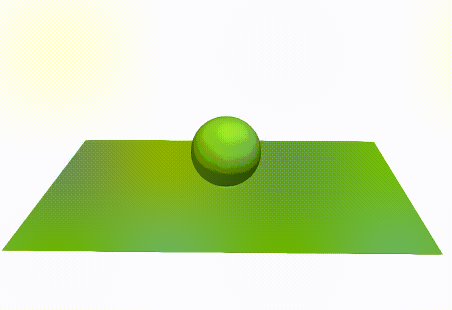](./Re20.mp4)

#### Milkcrown Re = 500

#### Milkcrown Re = 1000
[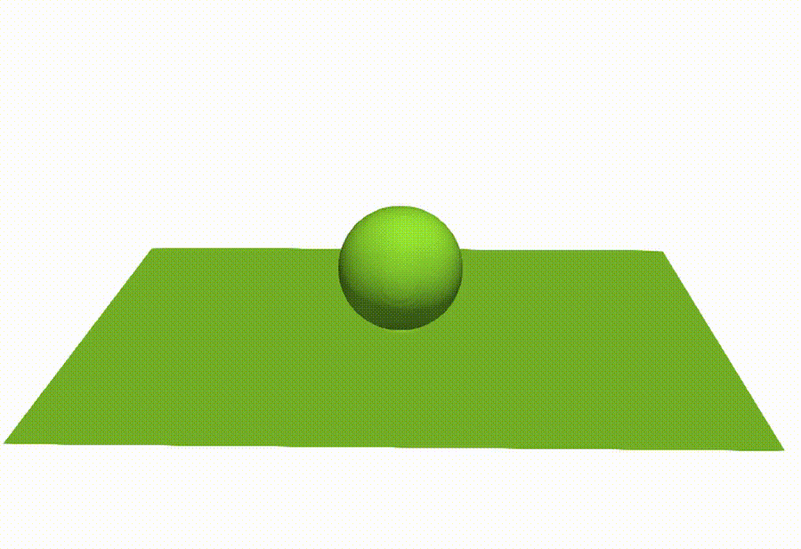](./Re1000.mp4)

#### Milkcrown Re = 2000
[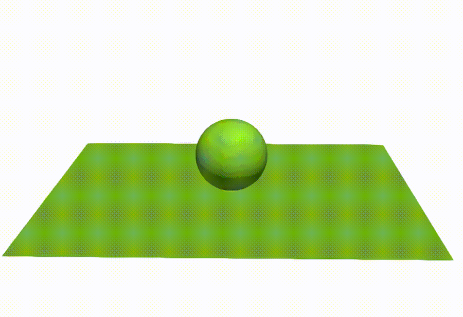](./Re2000.mp4)

#### Droplet on a post solid surface 
[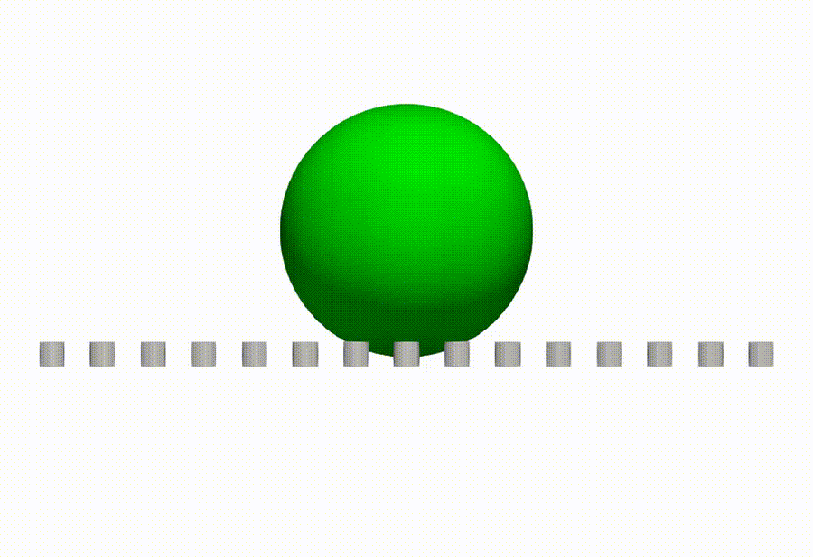](./post-real-y.mp4)
[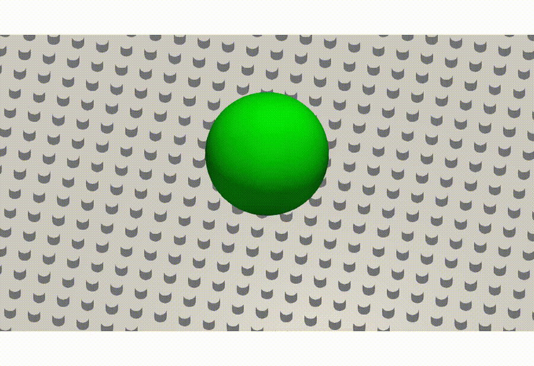](./post-real-z.mp4)

#### Droplet impact simulations on sawtooth, wavy structures under different contact angles
[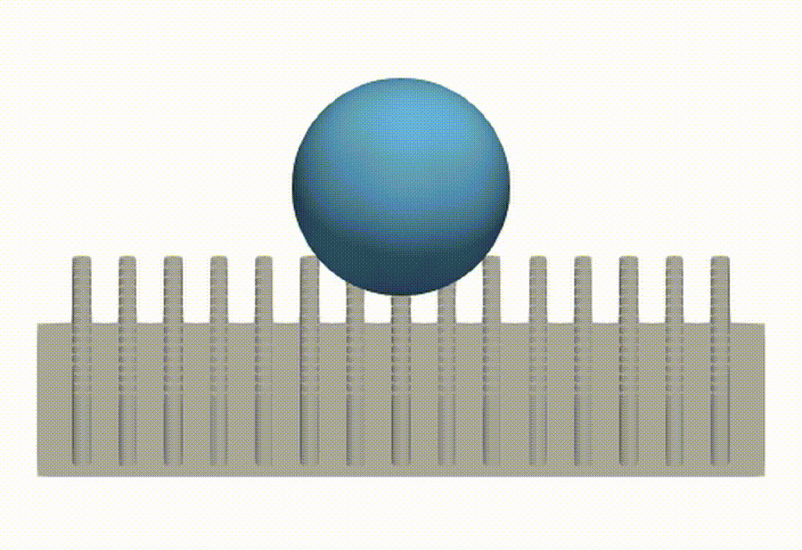](./post-60.mp4)
[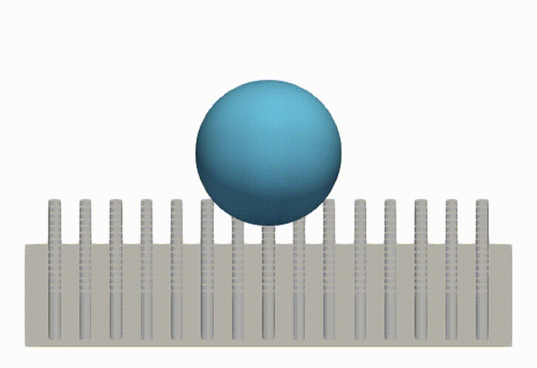](./post-150.mp4)
[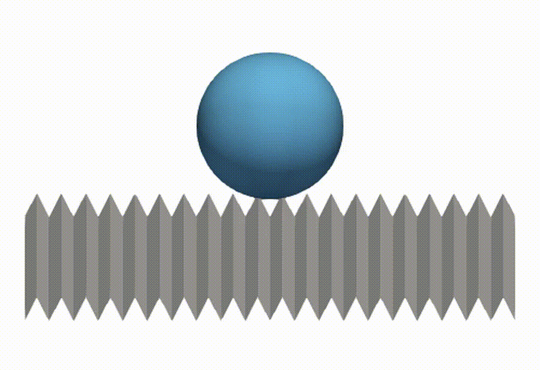](./sawtooth-60.mp4)
[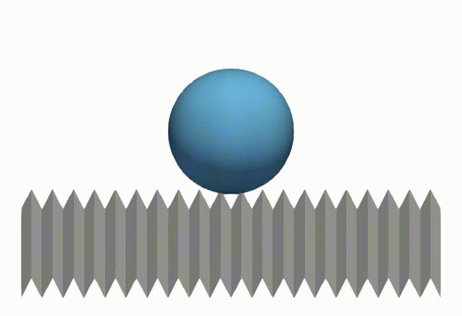](./sawtooth-150.mp4)
[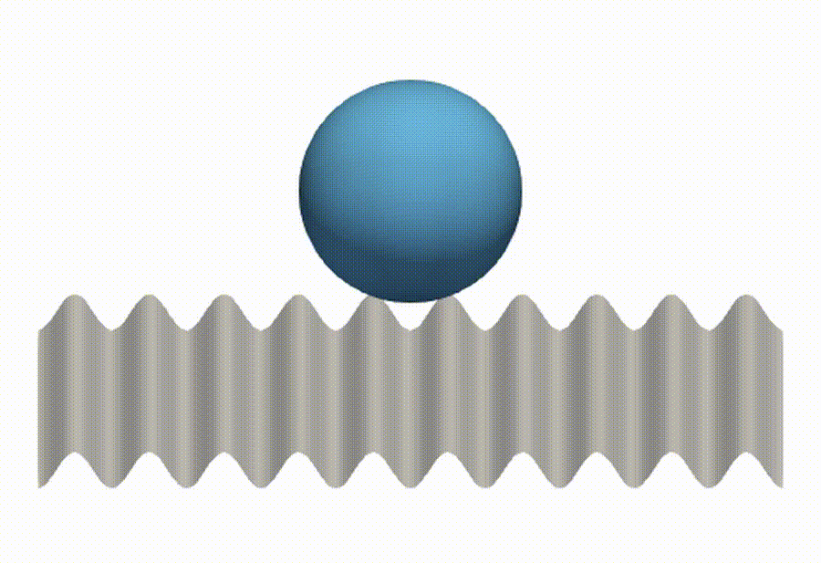](./wavy-60.mp4)
[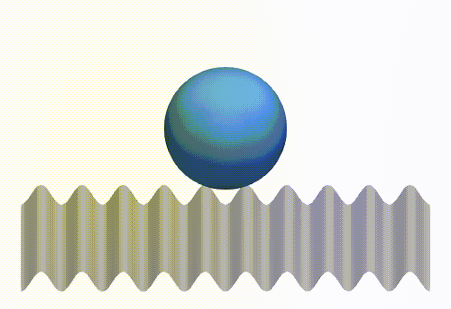](./wavy-150.mp4)

#### Comparison of equilibrium profiles of clean (blue) and contaminated (red) droplets on different surfaces
[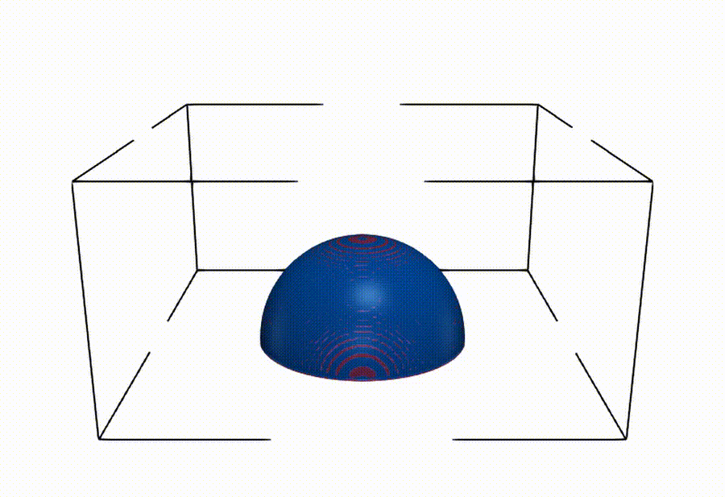](./gif/0814-60theta.gif)

